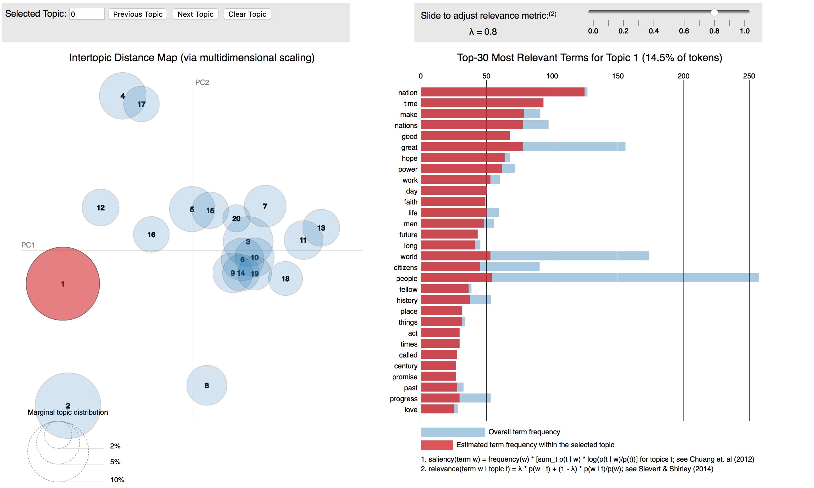
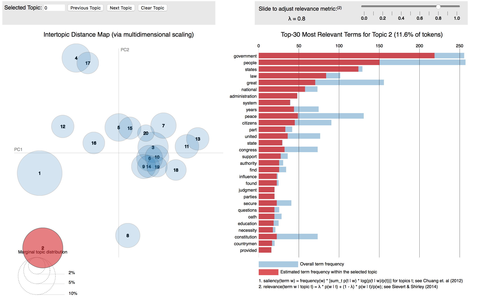
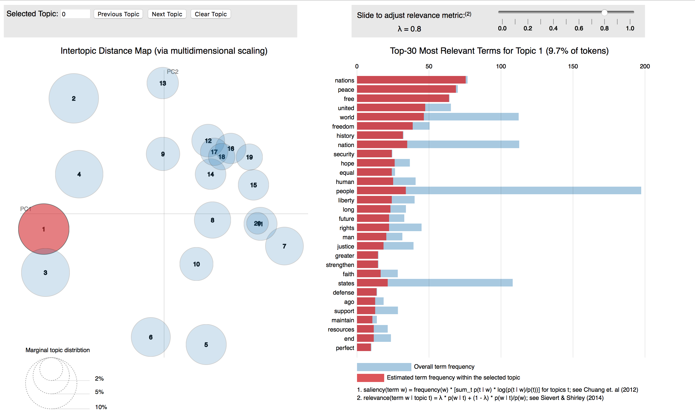
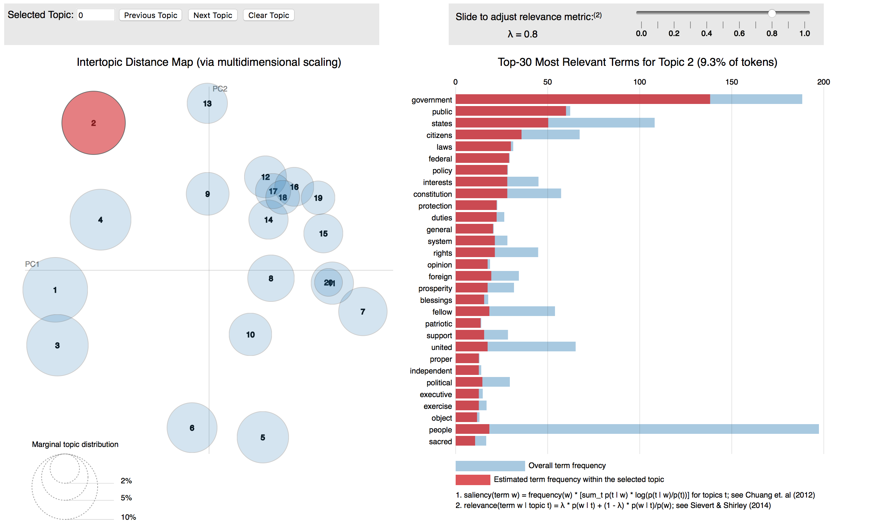

Inaugutal speeches are the beginning of presidency for each American president. It captures the sentiment of the time, and reflects the president's advocacy and his intended policies during his tenure. We can transform these speeches to quantified results by text mining analysis, to explore the unique characteristics or different aspects among them.

Sentiment analysis and topic modeling are two basic and major methods in text mining analysis. This time we basically use these two methods to conduct the project. The project will roughly explain four questions we interested:     
1) By applying Wordcloud method,could we see some connections between the president's speech and condition of era backgrounds?  
2) As time goes by, how the sentences length and the speeches length would change?   
3) How the president's sentiment would change during a speech? Who is the most sentimental president?   
4) If there are obvious differences of the topic selection between Republican Party and Democratic Party?

We have inaugutal speeches and additional information for each American President from George Washington to Donald J.Trump. For question 1-3, we chose six presidents who can represent the different society situation and era conditions during their tenure, they are George Washington (1789 and 1793), Andrew Jackson (1829 and 1833), Franklin D. Roosevelt (1933,1937,1941 and 1945), Dwight D. Eisenhower (1953 and 1957), George W. Bush (2001 and 2005), Barack Obama (2009 and 2013). For question 4, in order to find a more accurate and general result, we decided to use all the speeches for all presidents.

#Step 1: Install needed packages and load the libraries and functions
```{r, warning=FALSE, message=FALSE}
#Please remove '#' if you need install specific packages which you do not have 
#install.packages("tm")  # for text mining
#install.packages("SnowballC") # for text stemming
#install.packages("wordcloud") # word-cloud generator 
#install.packages("RColorBrewer") # color palettes
#install.packages("rvest")
#install.packages("tibble")
#install.packages("qdap")
#install.packages("sentimentr")
#install.packages("gplots")
#install.packages("dplyr")
#install.packages("syuzhet")
#install.packages("beeswarm")
#install.packages("factoextra")
#install.packages("scales")
#install.packages("RANN")
#install.packages("topicmodels")
#install.packages("rJava",type='source')
#install.packages("lda")
#install.packages('servr') 
#install.packages("LDAvis")

# Load
library("tm")
library("SnowballC")
library("wordcloud")
library("RColorBrewer")
library("rvest")
library("tibble")
library("qdap")
library("sentimentr")
library("gplots")
library("dplyr")
library("syuzhet")
library("factoextra")
library("beeswarm")
library("scales")
library("RANN")
library("topicmodels")
library("LDAvis")
library(lda)
#source("/Users/Xiaoyu/Documents/GitHub/adsFall2017/project 1/Fall2017-Project1-RNotebook-master/lib/plotstacked.R")
#source("/Users/Xiaoyu/Documents/GitHub/adsFall2017/project 1/Fall2017-Project1-RNotebook-master/lib/speechFuncs.R")
source("../lib/plotstacked.R")
source("../lib/speechFuncs.R")
#print(R.version)
```

#Step 2: Use Wordcloud to visualize terms for three eras

We use the wordcloud package to display the visualization of word frequency of three different eras. There are interesting connections appearing between the most frequency words and the condition of era backgrounds.

First era (1789-1833)
```{r}
folder.path="../data/data1"
#folder.path="/Users/Xiaoyu/Documents/GitHub/adsFall2017/project 1/Fall2017-Project1-RNotebook-master/data/data1"
speeches=list.files(path = folder.path, pattern = "*.txt")
prex.out=substr(speeches, 6, nchar(speeches)-4)
ff.doc=Corpus(DirSource(folder.path,encoding="UTF-8"))

ff.doc=tm_map(ff.doc, removeNumbers)  
ff.doc=tm_map(ff.doc, stripWhitespace)
ff.doc=tm_map(ff.doc, content_transformer(tolower))
ff.doc=tm_map(ff.doc, removeWords, stopwords('english'))
ff.doc=tm_map(ff.doc, removeWords, character(0))
ff.doc=tm_map(ff.doc, removePunctuation)
ff.doc=tm_map(ff.doc,removeWords,c("upon","shall","can","many","must","make","much","time","let","among","may","made","will"))
tdm.all=TermDocumentMatrix(ff.doc)

tdm1=as.matrix(tdm.all)
v=sort(rowSums(tdm1),decreasing = TRUE)

wordcloud (ff.doc, scale=c(3,0.5), max.words=100, min.freq=5, random.order=FALSE, rot.per=0.35, use.r.layout=T, random.color=FALSE, colors=brewer.pal(9,"Reds"))
```

During the early republic and Jacksonian Democracy period, the Bill of Rights came into existence and there was greater democracy for the common man, words such as UNION, RIGHTS and CONSITUTION were often repeated. In addition, LIBERTY, POWER and POLICY became important themes with the growing expansion.

Second era (1933-1957)
```{r}
#folder.path="/Users/Xiaoyu/Documents/GitHub/adsFall2017/project 1/Fall2017-Project1-RNotebook-master/data/data2"
folder.path="../data/data2"

speeches=list.files(path = folder.path, pattern = "*.txt")
prex.out=substr(speeches, 6, nchar(speeches)-4)
ff.doc=Corpus(DirSource(folder.path,encoding="UTF-8"))
#print(prex.out)

ff.doc=tm_map(ff.doc, removeNumbers)  
ff.doc=tm_map(ff.doc, stripWhitespace)
ff.doc=tm_map(ff.doc, content_transformer(tolower))
ff.doc=tm_map(ff.doc, removeWords, stopwords('english'))
ff.doc=tm_map(ff.doc, removeWords, character(0))
ff.doc=tm_map(ff.doc, removePunctuation)
ff.doc=tm_map(ff.doc,removeWords,c("upon","shall","can","many","must","make","much","time","let","among","may","made","will","know","men"))
tdm.all=TermDocumentMatrix(ff.doc)

tdm1=as.matrix(tdm.all)
v=sort(rowSums(tdm1),decreasing = TRUE)

wordcloud (ff.doc, scale=c(3,0.5), max.words=100, min.freq=5, random.order=FALSE, rot.per=0.35, use.r.layout=T, random.color=FALSE, colors=brewer.pal(9,"Blues"))
```

The Great Depression lasted from 1929 to 1939, and was the worst economic downturn in the history of the industrialized world. By 1933, when the Great Depression reached its lowest point, some 15 million Americans were unemployed and nearly half the country’s banks had failed. So we can see the themes around WORK, ECONOMICS and WEALTH being highlighted. Then, the Japanese attack on Pearl Harbor in December 1941 led to America’s entry into World War II, and the nation’s factories went back in full production mode. The themes such as PEACE, FREEDOM and LIFE became the most frequency words at inaugural speeches.

Third era (2001-2013)
```{r}
#folder.path="/Users/Xiaoyu/Documents/GitHub/adsFall2017/project 1/Fall2017-Project1-RNotebook-master/data/data3"
folder.path="../data/data3"
speeches=list.files(path = folder.path, pattern = "*.txt")
prex.out=substr(speeches, 6, nchar(speeches)-4)
ff.doc=Corpus(DirSource(folder.path,encoding="UTF-8"))
#print(prex.out)

ff.doc=tm_map(ff.doc, removeNumbers)  
ff.doc=tm_map(ff.doc, stripWhitespace)
ff.doc=tm_map(ff.doc, content_transformer(tolower))
ff.doc=tm_map(ff.doc, removeWords, stopwords('english'))
ff.doc=tm_map(ff.doc, removeWords, character(0))
ff.doc=tm_map(ff.doc, removePunctuation)
ff.doc=tm_map(ff.doc,removeWords,c("upon","shall","can","many","must","make","much","time","let","among","may","made","will","know","men","every"))
tdm.all=TermDocumentMatrix(ff.doc)

tdm1=as.matrix(tdm.all)
v=sort(rowSums(tdm1),decreasing = TRUE)

wordcloud (ff.doc, scale=c(3,0.5), max.words=100, min.freq=5, random.order=FALSE, rot.per=0.35, use.r.layout=T, random.color=FALSE, colors=brewer.pal(9,"Greens"))
```

In 20th century, rapid globalization increases the interaction of people through the growth of the international flow of money, ideas and culture. It means that the focus on WORLD, NEW and COUNTRY remains the key highlights. At the same time, the themes such as PEOPLE, JUSTICE and FREEDOM are also the important topics the presidents would pay attention to.  

#Step 3: Analysis of Sentence length and Speeches length
Sentence Length
```{r,message=FALSE, warning=FALSE}
#speech.list = read.csv("/Users/Xiaoyu/Documents/GitHub/adsFall2017/project 1/Fall2017-Project1-RNotebook-master/data/speech.list.csv",header = T,as.is = T)
speech.list = read.csv("../data/speech.list.csv",header = T,as.is = T)
sentence.list=NULL
for(i in 1:nrow(speech.list)){
  sentences=sent_detect(speech.list$fulltext[i],
                        endmarks = c("?", ".", "!", "|",";"))
  if(length(sentences)>0){
    emotions=get_nrc_sentiment(sentences)
    word.count=word_count(sentences)
    # colnames(emotions)=paste0("emo.", colnames(emotions))
    # in case the word counts are zeros?
    emotions=diag(1/(word.count+0.01))%*%as.matrix(emotions)
    sentence.list=rbind(sentence.list, 
                        cbind(speech.list[i,-ncol(speech.list)],
                              sentences=as.character(sentences), 
                              word.count,
                              emotions,
                              sent.id=1:length(sentences),row.names = NULL
                              )
    )
  }
}
```

```{r}
sentence.list=
  sentence.list%>%
  filter(!is.na(word.count)) 

sel.comparison=c( "GeorgeWashington","AndrewJackson","FranklinDRoosevelt", "DwightDEisenhower", "GeorgeWBush", "BarackObama")

sentence.list.sel=filter(sentence.list, 
                        type=="inaug",  File%in%sel.comparison)
sentence.list.sel$File=factor(sentence.list.sel$File)
sentence.list.sel$FileOrdered=reorder(sentence.list.sel$File,
                                  sentence.list.sel$word.count,
                                  mean,
                                  order=T)
par(mar=c(4, 11, 2, 2))
beeswarm(word.count~FileOrdered,
         data=sentence.list.sel,
         horizontal = TRUE,
         pch=16, col=alpha(brewer.pal(9, "Set1"), 0.6),
         cex=0.55, cex.axis=0.8, cex.lab=0.8,
         spacing=5/nlevels(sentence.list.sel$FileOrdered),
         las=2, ylab="", xlab="Number of words in a sentence.",
         main="Inaugural Speeches")
```

We zoom in the number of words in a sentence of each president's speech. From the "Inaugural Speeches" graph we figure out that as time goes on, the sentence was becoming shorter. This indicates that the english language has tendency to be more concise and simplifie, and the people who facilitated the president had improvement with more concise words and more concentrated ideology.

Speech Length
```{r,warning=FALSE}
library(reshape2)
speech.list2=subset(speech.list,President=="George Washington"|President=="Franklin D. Roosevelt"|President=="Dwight D. Eisenhower"|President=="Andrew Jackson"|President=="Barack Obama"|President=="George W. Bush")
speech.list2=subset(speech.list2,type=="inaug")
speech.list2$Words = as.numeric(speech.list2$Words)
ggplot(data=speech.list2,aes(x=reorder(President,-Words),y=Words,fill=Words))+
   scale_x_discrete(labels = abbreviate)+
   xlab("President")+
   geom_bar(stat="identity",position="dodge",width = 0.8)+
   ggtitle("Speeches length in words for six presidents")
```

The bar-plot above shows that basiclly as time goes by, the inaugural speeches' length increases. In order to see if this is a general case we would like to do the speeches analysis for all presidents.

```{r}
speech.list3=subset(speech.list,type=="inaug")
speech.list3$Words = as.numeric(speech.list3$Words)
speech.list3$President=as.character(speech.list3$President)
speech.list3$President=factor(speech.list3$President,levels=unique(speech.list3$President))
ggplot(data=speech.list3, aes(x=President, y=Words,group=Party, color=Party)) +
    geom_line() +
    geom_point()+
    theme(axis.text.x=element_blank(),
        axis.ticks.x=element_blank())+
    ggtitle("Speeches length in words for all presidents")
```

(the presidents at x-axis are ordered by time from the earlist to the most recent)
Apparently, ignoring some of the outliers, there is a decreasing trend of the speeches length for all presidents , which is different from the result we got on the last bar-plot. So generally speacking, as time goes by, most presidents would like to give us a short snappy speech.

#Step 4: Sentiment Analysis 

In this step, we would like to figure out how the president's sentiment would change during a speech and who is the most sentimental president.

```{r,message=FALSE}
hu.liu.pos = readLines('https://www.dropbox.com/sh/3xctszdxx4n00xq/AAA_Go_Y3kJxQACFaVBem__ea/positive-words.txt?dl=1');
hu.liu.neg = readLines('https://www.dropbox.com/sh/3xctszdxx4n00xq/AABTGWHitlRZcddq1pPXOSqca/negative-words.txt?dl=1');
score.sentiment = function(sentences, pos.words, neg.words, .progress='none')
  {
    require(plyr);
    require(stringr);
    scores = laply(sentences, function(sentence, pos.words, neg.words) {
      sentence = gsub('[^A-z ]','', sentence)
      sentence = tolower(sentence);
      word.list = str_split(sentence, '\\s+');
      words = unlist(word.list);
      pos.matches = match(words, pos.words);
      neg.matches = match(words, neg.words);
      pos.matches = !is.na(pos.matches);
      neg.matches = !is.na(neg.matches);
      score = sum(pos.matches) - sum(neg.matches);
      return(score);
    }, pos.words, neg.words, .progress=.progress );
    scores.df = data.frame(score=scores, text=sentences);
    return(scores.df);
}

par(mfrow=c(2,3))

sample=speech.list2$fulltext[speech.list2$President=="George Washington"]
sample=strsplit(sample,". ",fixed = T)
result1=score.sentiment(sample[[1]],hu.liu.pos,hu.liu.neg)
plot(result1$score,type="o",xlab="index",ylab="sentiment",main="George Washington",pch=19,cex=.5,col="red",panel.first = grid())

sample=speech.list2$fulltext[speech.list2$President=="Andrew Jackson"]
sample=strsplit(sample,". ",fixed = T)
result2=score.sentiment(sample[[1]],hu.liu.pos,hu.liu.neg)
plot(result2$score,type="o",xlab="index",ylab="sentiment",main="Andrew Jackson",pch=19,cex=.5,col="red",panel.first = grid())

sample=speech.list2$fulltext[speech.list2$President=="Franklin D. Roosevelt"]
sample=strsplit(sample,". ",fixed = T)
result3=score.sentiment(sample[[1]],hu.liu.pos,hu.liu.neg)
plot(result3$score,type="o",xlab="index",ylab="sentiment",main="Franklin D. Rooseveltn",pch=19,cex=.5,col="red",panel.first = grid())

sample=speech.list2$fulltext[speech.list2$President=="Dwight D. Eisenhower"]
sample=strsplit(sample,". ",fixed = T)
result4=score.sentiment(sample[[1]],hu.liu.pos,hu.liu.neg)
plot(result4$score,type="o",xlab="index",ylab="sentiment",main="Dwight D. Eisenhower",pch=19,cex=.5,col="red",panel.first = grid())

sample=speech.list2$fulltext[speech.list2$President=="Barack Obama"]
sample=strsplit(sample,". ",fixed = T)
result5=score.sentiment(sample[[1]],hu.liu.pos,hu.liu.neg)
plot(result5$score,type="o",xlab="index",ylab="sentiment",main="Barack Obama",pch=19,cex=.5,col="red",panel.first = grid())

sample=speech.list2$fulltext[speech.list2$President=="George W. Bush"]
sample=strsplit(sample,". ",fixed = T)
result6=score.sentiment(sample[[1]],hu.liu.pos,hu.liu.neg)
plot(result6$score,type="o",xlab="index",ylab="sentiment",main="George W. Bush",pch=19,cex=.5,col="red",panel.first = grid())
```

The six graphs above show us how the president sentiment changes during thier the very first inaugural speech. The x-axis presents how many sentences in each speech, since though analysis we broke the speech into each single sentence, and gave every sentence a score which shows at y-axis. The score >0 means positive sentiment, <0 means negative sentiment. The bigger the number, the more positive or negative sentiment the president would have. 
Next, we will explore who is the most sentimental president among the six representitive presidents.

```{r}
name=c("George Washington 1789","Andrew Jackson 1829","Franklin D. Roosevelt 1933","Dwight D. Eisenhower 1953","Barack Obama 2009","George W. Bush 2001")
num=c(mean(result1$score),mean(result2$score),mean(result3$score),mean(result4$score),mean(result5$score),mean(result6$score))
data=data.frame(name,num)
pre_name=data[[1]]
plot(data$num,ylab="sentiment",main="Average sentiment level for each president",xlab="president",pch=19,cex=1,col="blue",panel.first = grid(),xaxt='n',xlim=c(-1,7))
text(data$num,labels = pre_name,cex= 0.7, pos=2)
```

The score on y-axis is the average score of all sentences in the speech for each president. The plot shows that all the six presidnet have a positive sentiment; president Andrew Jackson and Georage Washington have higher sentiment score, and the rest have the lower and closely sentiment scores.

#Step 5: Topic Modeling

Now we use LDA to explore whether there are obvious differences of the topic selection between Republican Party and Democratic Party, here we will use all the inaugural speeches of presidents who are from Republican Party or Democratic Party.

```{r,warning=FALSE, message=FALSE}
speeches1=speech.list$fulltext[speech.list$type=="inaug"&speech.list$Party=="Republican"]
speeches2=speech.list$fulltext[speech.list$type=="inaug"&speech.list$Party=="Democratic"]
stop_words=stopwords("SMART")

speeches1=gsub("'", "", speeches1)  
speeches1=gsub("[[:punct:]]", " ", speeches1)  
speeches1=gsub("[[:cntrl:]]", " ", speeches1)  
speeches1=gsub("^[[:space:]]+", "", speeches1) 
speeches1=gsub("[[:space:]]+$", "", speeches1) 
speeches1=tolower(speeches1)
speeches2=gsub("'", "", speeches2)  
speeches2=gsub("[[:punct:]]", " ", speeches2)  
speeches2=gsub("[[:cntrl:]]", " ", speeches2)  
speeches2=gsub("^[[:space:]]+", "", speeches2) 
speeches2=gsub("[[:space:]]+$", "", speeches2) 
speeches2=tolower(speeches2)

doc.list1=strsplit(speeches1, "[[:space:]]+")
doc.list2=strsplit(speeches2, "[[:space:]]+")

term.table1=table(unlist(doc.list1))
term.table1=sort(term.table1, decreasing = TRUE)
term.table2=table(unlist(doc.list2))
term.table2=sort(term.table2, decreasing = TRUE)

del1=names(term.table1) %in% stop_words | term.table1 < 2
term.table1 = term.table1[!del1]
vocab1 = names(term.table1)
del2=names(term.table2) %in% stop_words | term.table2 < 2
term.table2 = term.table2[!del2]
vocab2= names(term.table2)

get.terms1=function(x) {
  index=match(x, vocab1)
  index=index[!is.na(index)]
  rbind(as.integer(index - 1), as.integer(rep(1, length(index))))
}
documents1=lapply(doc.list1, get.terms1)
get.terms2=function(x) {
  index=match(x, vocab2)
  index=index[!is.na(index)]
  rbind(as.integer(index - 1), as.integer(rep(1, length(index))))
}
documents2=lapply(doc.list2, get.terms2)

d1=length(documents1) 
w1=length(vocab1) 
doc.length1 =sapply(documents1, function(x) sum(x[2, ]))  
n1=sum(doc.length1) 
term.frequency1 =as.integer(term.table1) 
d2=length(documents2) 
w2=length(vocab2) 
doc.length2 =sapply(documents2, function(x) sum(x[2, ]))  
n2=sum(doc.length2)  
term.frequency2 =as.integer(term.table2)  

k=20
g=5000
alpha=0.02
eta=0.02
set.seed(357)
t11=Sys.time()
fit1=lda.collapsed.gibbs.sampler(documents = documents1, K = k, vocab = vocab1,
                                   num.iterations = g, alpha = alpha,
                                   eta = eta, initial = NULL, burnin = 0,
                                   compute.log.likelihood = TRUE)
t21 =Sys.time()
t21 - t11  
t12=Sys.time()
fit2=lda.collapsed.gibbs.sampler(documents = documents2, K = k, vocab = vocab2,
                                   num.iterations = g, alpha = alpha,
                                   eta = eta, initial = NULL, burnin = 0,
                                   compute.log.likelihood = TRUE)
t22 =Sys.time()
t22 - t12  

theta1 =t(apply(fit1$document_sums + alpha, 2, function(x) x/sum(x)))
phi1=t(apply(t(fit1$topics) + eta, 2, function(x) x/sum(x)))

MovieReviews1=list(phi = phi1,
                     theta = theta1,
                     doc.length = doc.length1,
                     vocab = vocab1,
                     term.frequency = term.frequency1)

theta2 =t(apply(fit2$document_sums + alpha, 2, function(x) x/sum(x)))
phi2=t(apply(t(fit2$topics) + eta, 2, function(x) x/sum(x)))

MovieReviews2=list(phi = phi2,
                     theta = theta2,
                     doc.length = doc.length2,
                     vocab = vocab2,
                     term.frequency = term.frequency2)

json1=createJSON(phi = MovieReviews1$phi,
                  theta = MovieReviews1$theta,
                    doc.length = MovieReviews1$doc.length,
                    vocab = MovieReviews1$vocab,
                    term.frequency = MovieReviews1$term.frequency)
 
 json2=createJSON(phi = MovieReviews2$phi,
                   theta = MovieReviews2$theta,
                    doc.length = MovieReviews2$doc.length,
                    vocab = MovieReviews2$vocab,
                   term.frequency = MovieReviews2$term.frequency)
 
 serVis(json1, out.dir = 'vis1', open.browser =F)
 serVis(json2, out.dir = 'vis2', open.browser =F)
```

The method for viewing the interactive graphs: there are two interesting interactive graphs we got from LDAvis, each of them presents the 20 most possible topics for Republican Party speeches or Democratic Party speeches. If you would like to view these two interactive graphs, here is the OPENNING PROCEDURE (after you have downloaded my whole project folders 'fall2017-project1-Sherrywz' from Github):  
1) Pleace open the 'Terminal' in your computer and input the command 'python -m SimpleHTTPServer 8000', hit the Enter key;  
2) Open a browser and input 'localhost:8000' at address bar, hit the Enter key;  
3) Now open the folder 'fall2017-project1-Sherrywz-master' you downloaded before and then open the sub-folder "vis1" and "vis2". More specificly, they are: fall2017-project1-Sherrywz-master/doc/vis1 and fall2017-project1-Sherrywz-master/doc/vis2  
4) After viewing graphs, you could press 'Control+C' in 'Terminal' to close your local server.  

In order to explain the results we got in this step, I would like to show some static graphs following. In these graphs, the bigger the number or the circle is, there is more possibility that this is exactly the topic of these speeches. 

For Republican Party:



The Republican Party's current ideology is American conservatism, which is a broad system of political beliefs in the United States that is characterized by respect for American traditions. The first topic mainly includes "work", "citizens", "life", etc, which reflect Republican Party's support for that each person is responsible for their own place within society, and limiting the Government’s intervention in the work of the individual towards prosperity. The second topic concentrates on "people", "government", "secure", "peace", etc. These words reflect the concentration of responsibility of government, and Republican Party's American conservatism policy.

For Democratic Party:



The Democratic Party's current ideology (called modern liberalism) is more progressive than Republican Party's,it involves support for free market capitalism, free enterprise, fiscal conservatism, a strong national defense, deregulation, and restrictions on labor unions. The first topic mainly includes "freedom", "world", "future", etc, which reflect Democratic Party's support for free market capitalism or free enterprise around the world. The second topic concentrates on "laws", "government", "policy", "pretection", etc. These words reflect the concentration of responsibility of government and strong national defense.

#Step 6: Summary
Through text mining analysis, we got a bunch of interesting results from presidents' inaugural speeches. As time goes by, some elements keep staying and will not disappear in future, but some others have changed along with the development of American society. Now, I would like to give a brief summary answer for the questions I mentioned at the beginning of this project:  
1) By applying Wordcloud method, we could through the most frequency words to roughly know what happened or what was the president or americans were paying attention to at that time. Therefore we can conclude there are some connections between the president's speech and condition of era backgrounds.  
2) As time goes by, the sentences length and the speeches length both become shorter.  
3) Through sentiment analysis we gave scores to presidents' speech, then we could see how their sentiment changed graphicly during speeches, and among the six presidents we chose Andrew Jackson is the most sentimental president.  
4) By viewing the interactive graphs we got from topic modeling, we conclude that Republican Party is more conservative than Democratic Party, but Democratic Party is more progressive than Republican Party. On the one hand, both of these two parties support the authority of goverment and strong national defense. On the other hand, the Republican Party believes goverment should not intervent too much on individual's life, but Democratic Party support the restrictions on labor unions and give more freedom to market and enterprese.


